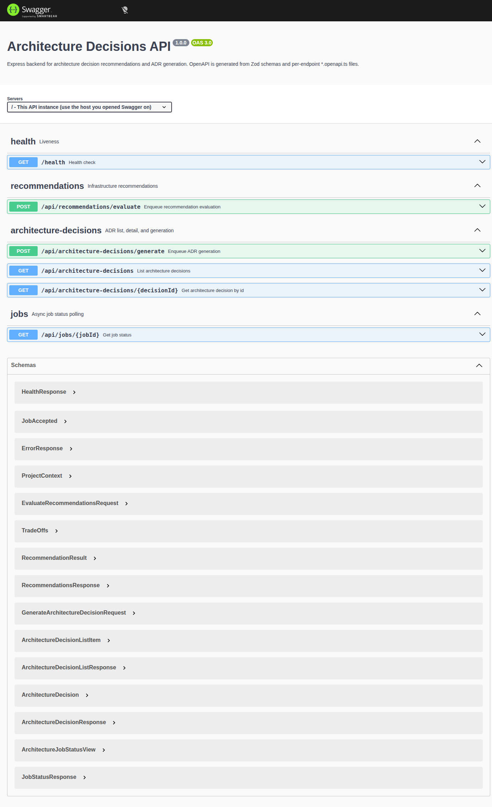
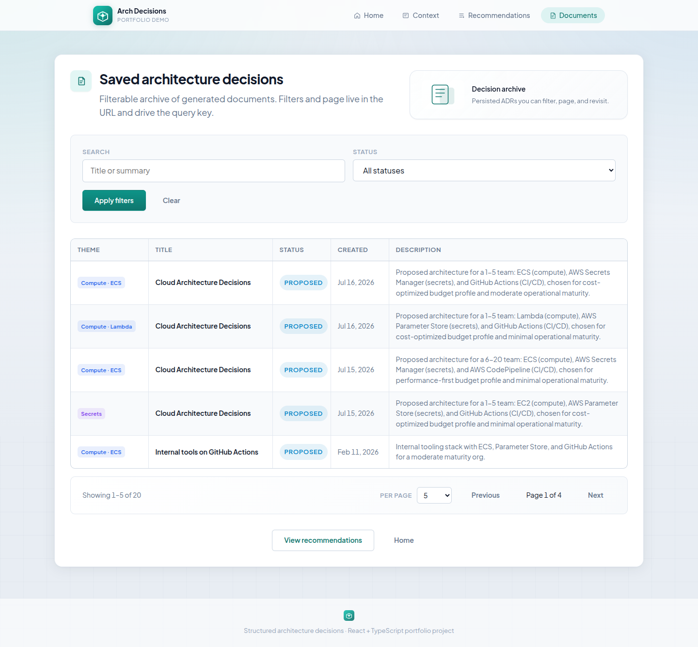

# Architecture Decisions — Express backend

Node/Express API that turns project context into infrastructure recommendations and Architecture Decision Records (ADRs).

**Audience:** hiring managers and engineers reviewing a **senior Node backend** — layered services, BullMQ jobs, Zod/OpenAPI, fail-loud providers.

Same HTTP contract as the [Python twin](../backend-python/README.md) (`202` + job polling).

---

## What you get

1. **Evaluate recommendations** — `POST /api/recommendations/evaluate` → **202** + poll job  
2. **Generate ADRs** — `POST /api/architecture-decisions/generate` → **202** + persist  
3. **List / get decisions** — search + status filters  
4. **Swagger** — code-first OpenAPI at `/api-docs`

Stack: Node 24 · Express 5 · TypeScript · Zod + zod-to-openapi · BullMQ + Redis · SQLite (Knex) or memory · Winston · Jest · optional OpenAI.

---

## Screenshots

| Swagger | Recommendations (companion UI) |
|---------|--------------------------------|
|  |  |

| Documents | ADR full |
|-----------|----------|
|  |  |

More: [docs/screenshots/](./docs/screenshots/).

---

## Quick start (Docker)

From the **monorepo root**:

```bash
make docker-up
```

| Service | URL |
|---------|-----|
| Express API | http://localhost:3001 |
| Health | http://localhost:3001/health |
| **Swagger UI** | http://localhost:3001/api-docs |
| OpenAPI JSON | http://localhost:3001/openapi.json |

Stop: `make docker-down`

Details: [docs/getting-started.md](./docs/getting-started.md)

---

## Documentation

| Document | Purpose |
|----------|---------|
| [docs/README.md](./docs/README.md) | Docs index |
| [docs/getting-started.md](./docs/getting-started.md) | Run, test, verify providers |
| [docs/architecture.md](./docs/architecture.md) | Decisions, providers, layout |
| [docs/reference.md](./docs/reference.md) | API, env, scripts |
| [docs/practices.md](./docs/practices.md) | **Must-have checklist + code proof** |
| [docs/for-reviewers.md](./docs/for-reviewers.md) | 5-minute review path |
| [docs/screenshots/](./docs/screenshots/) | Swagger + companion UI |
| [../README.md](../README.md) | Monorepo landing |
| [../backend-python/README.md](../backend-python/README.md) | Python twin |
| [../frontend/README.md](../frontend/README.md) | Companion React app |

---

## Highlights

- **Explicit provider selection** — mock/OpenAI, template/OpenAI, sqlite/memory; misconfig throws  
- **Layered backend + BullMQ** — controllers → services → integrations; async off the request  
- **Code-first OpenAPI** — Zod schemas + sibling `*.openapi.ts`  
- **Tests** — ~47 Jest tests (unit + Supertest HTTP)

Full evidence: [docs/practices.md](./docs/practices.md).

---

## Layout

```text
src/
├── app/             # composition root (Awilix DI wiring)
├── routes/          # endpoints definition + OpenAPI documentation
├── controllers/     # controller definitions that delegate business logic to services
├── services/        # application business logic
├── integrations/    # external resource adapters (AI, database, queue)
├── jobs/            # background workers and processes
├── domain/          # pure business types and rules
├── config/          # environment settings by concern
├── openapi/         # shared OpenAPI / Zod schema pieces
├── validators/      # HTTP request validation schemas
├── middleware/      # correlation ID per request and other middleware
├── lib/             # shared helpers (HTTP, errors, logging)
├── migrations/      # Knex database schema migrations
└── test/            # integration test helpers and fixtures
```

Flow: `routes` → `controllers` → `services` → `integrations`.

---

## License

Portfolio / demonstration package (part of the arch-decisions monorepo).
