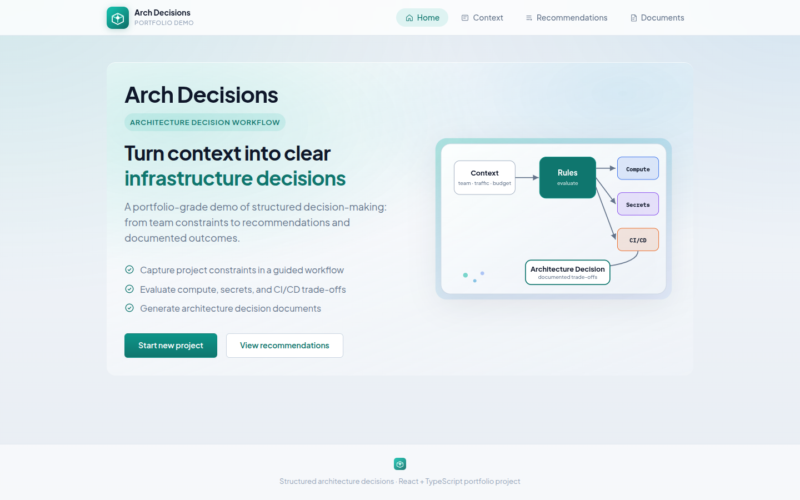
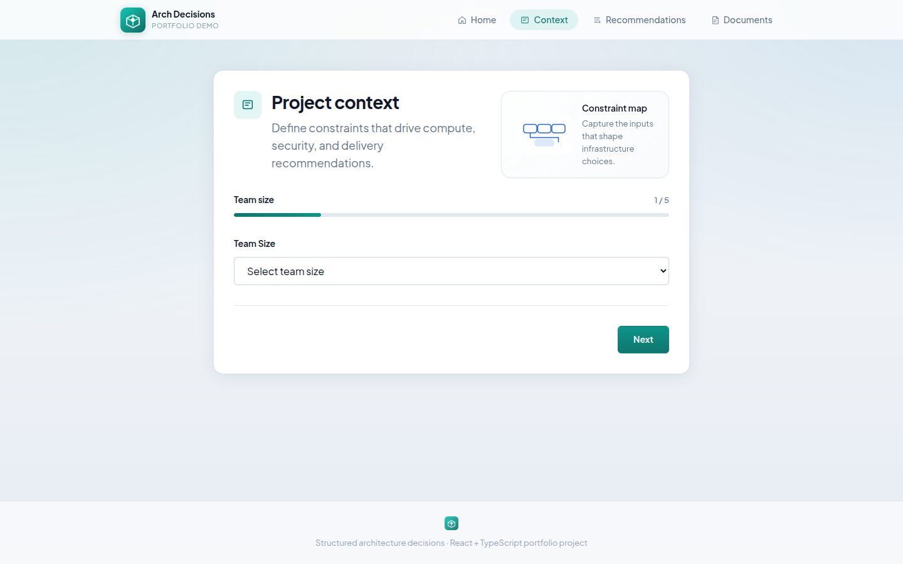
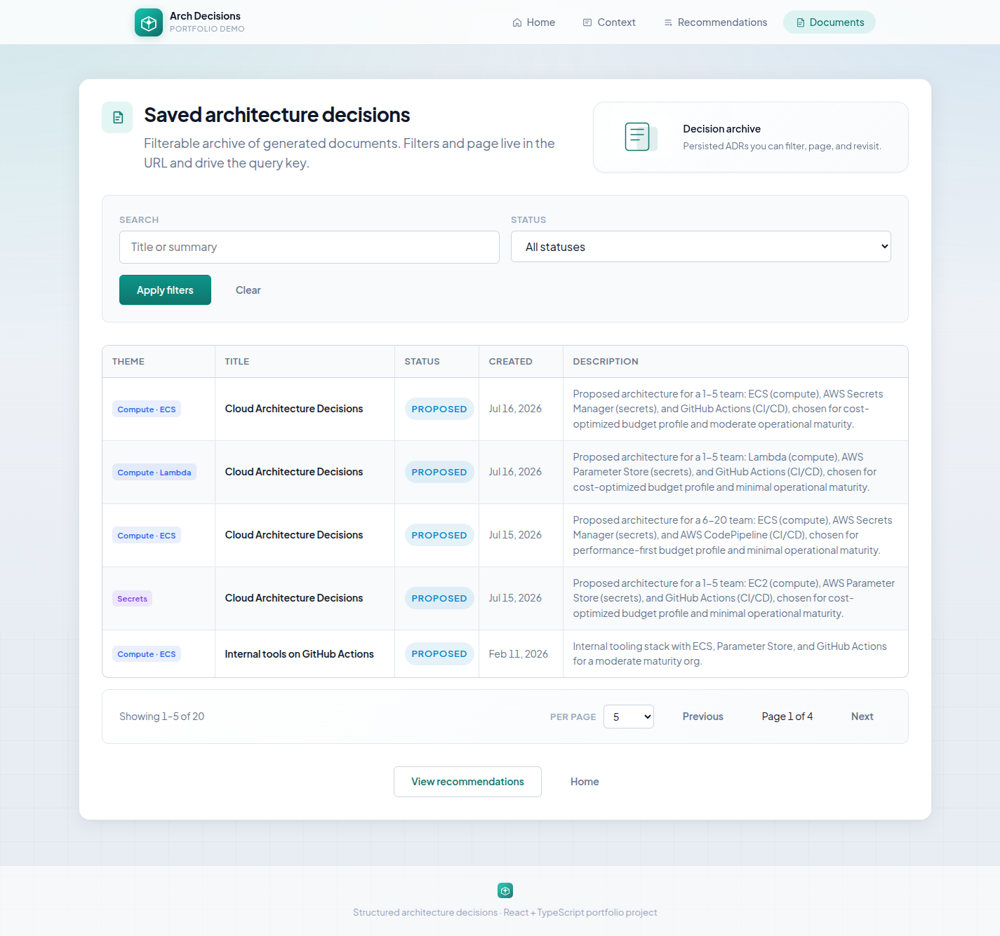
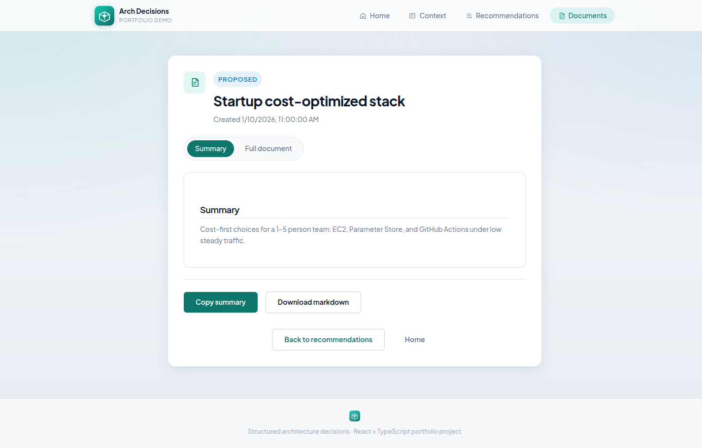
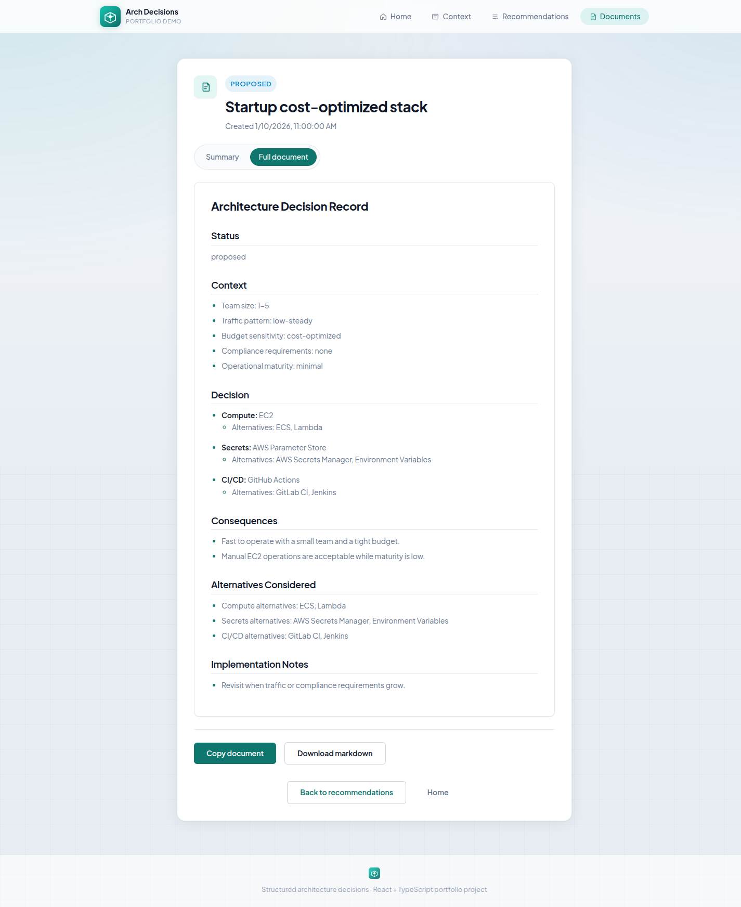

# Full journey: context → recommendations → architecture decision record

This walkthrough mirrors the UI flow and shows how structured input becomes documented output.

## Visual tour












## 1. Define project context

**Route:** `/context`

**Example input:** [startup-cost-optimized.json](../scenarios/startup-cost-optimized.json)

```json
{
  "teamSize": "1-5",
  "trafficPattern": "low-steady",
  "budgetSensitivity": "cost-optimized",
  "complianceRequirements": [],
  "operationalMaturity": "minimal"
}
```

**What happens:**
- User completes the 5-step wizard (team, traffic, budget, compliance, maturity).
- On submit, the frontend calls `POST /api/recommendations/evaluate` with the context.
- Context and recommendations are stored in `sessionStorage` for the current browser session.

## 2. Review recommendations

**Route:** `/recommendations`

**Representative output** (rule-based evaluation; production may use OpenAI with the same contract):

| Category | Recommended | Why it fits this context |
|----------|-------------|----------------------------|
| Compute | EC2 | Small team + cost-optimized → minimal orchestration overhead |
| Secrets | AWS Parameter Store | No compliance mandate → simpler, lower-cost secret storage |
| CI/CD | GitHub Actions | Cost-optimized team size → managed CI with low setup cost |

Each category card shows alternatives and trade-offs (cost, complexity, risk, ops overhead).

## 3. Generate architecture decision document

**Action:** Click **Generate architecture decision** on `/recommendations`.

**API:** `POST /api/architecture-decisions/generate`

```json
{
  "context": { "...": "same as step 1" },
  "recommendations": {
    "compute": { "category": "compute", "recommended": "EC2", "...": "..." },
    "secrets": { "...": "..." },
    "cicd": { "...": "..." }
  }
}
```

**Provider:** `ARCHITECTURE_DECISION_GENERATOR_PROVIDER=template` (deterministic) or `openai` (AI-assisted).

**Response:** Document with `id`, `title`, `status`, `summary`, `content` (markdown), `createdAt`.

## 4. View and export

**Route:** `/architecture-decisions/:decisionId`

- **Summary view** — condensed rationale for stakeholders.
- **Full view** — complete markdown ADR.
- **Copy** / **Download markdown** — export for wikis or git repos.

**Example full document:** [startup-cost-optimized.md](../adrs/startup-cost-optimized.md)

## Try other scenarios

| Scenario | Context file | Example ADR |
|----------|--------------|-------------|
| Enterprise regulated | [enterprise-compliance.json](../scenarios/enterprise-compliance.json) | [enterprise-compliance.md](../adrs/enterprise-compliance.md) |
| High-traffic growth | [scale-high-traffic.json](../scenarios/scale-high-traffic.json) | Generate via UI or API |

## API quick reference

```bash
# Evaluate recommendations (use the "context" object from a scenario file)
curl -s -X POST http://localhost:3001/api/recommendations/evaluate \
  -H 'Content-Type: application/json' \
  -d '{"context":{"teamSize":"1-5","trafficPattern":"low-steady","budgetSensitivity":"cost-optimized","complianceRequirements":[],"operationalMaturity":"minimal"}}'

# Generate ADR (requires full request body with context + recommendations from evaluate)
curl -s -X POST http://localhost:3001/api/architecture-decisions/generate \
  -H 'Content-Type: application/json' \
  -d '{ "context": {...}, "recommendations": {...} }'

# Fetch generated ADR
curl -s http://localhost:3001/api/architecture-decisions/{decisionId}
```
