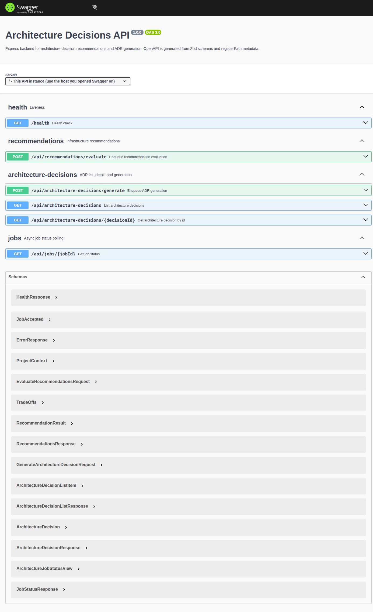
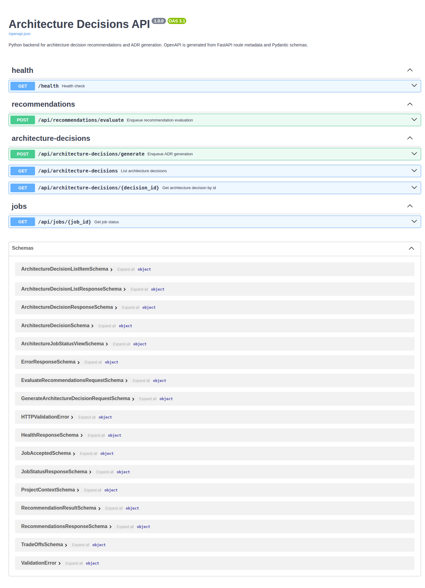

# Reference

## API

Two interchangeable backends share the same HTTP contract:

| Backend | Base URL (local Docker) | Swagger UI |
|---------|-------------------------|------------|
| Express | `http://localhost:3001` | http://localhost:3001/api-docs |
| Python (FastAPI) | `http://localhost:3002` | http://localhost:3002/docs |

OpenAPI is **generated from code** on each backend (same HTTP contract, separate schemas):

| Backend | Schemas | Route metadata | Live spec |
|---------|---------|----------------|-----------|
| Express | [openapi/schemas.ts](../backend/src/openapi/schemas.ts) | [register-paths.ts](../backend/src/openapi/register-paths.ts) | http://localhost:3001/openapi.json |
| Python | [api/schemas](../backend-python/src/arch_decisions/api/schemas/__init__.py) | FastAPI route decorators | http://localhost:3002/openapi.json |

### Swagger screenshots

| Express ([view](./screenshots/07-swagger-express.png)) | Python ([view](./screenshots/08-swagger-python.png)) |
|---------|--------|
|  |  |

### Health

`GET /health` → `{ "status": "ok", "message": "..." }`

### Recommendations

`POST /api/recommendations/evaluate`

Body: `{ "context": ProjectContext }` (or raw context object).

Response: **202** `{ "jobId": "..." }` — poll job status, then read `result` when `status` is `completed`.

### Architecture decisions

`POST /api/architecture-decisions/generate`

Body: `{ "context": ProjectContext, "recommendations": RecommendationsResponse }`

Response: **202** `{ "jobId": "..." }`

`GET /api/architecture-decisions?search=&status=` → `{ "architectureDecisions": [...] }`

`GET /api/architecture-decisions/:decisionId` → `{ "architectureDecision": { ... } }`

### Jobs

`GET /api/jobs/:jobId` → `{ "job": { "jobId", "type", "status", "result?", "error?" } }`

Statuses: `waiting`, `active`, `completed`, `failed`, `delayed`, `unknown`.

Errors include `correlationId` when available.

---

## ProjectContext

```json
{
  "teamSize": "1-5 | 6-20 | 21-50 | 50+",
  "trafficPattern": "low-steady | variable | high-spike",
  "budgetSensitivity": "cost-optimized | balanced | performance-first",
  "complianceRequirements": ["SOC2", "HIPAA", "GDPR", "PCI-DSS"],
  "operationalMaturity": "minimal | moderate | mature"
}
```

Sample files: [examples/scenarios/](./examples/scenarios/)

---

## Environment variables

### Root (`.env` — Docker Compose interpolation)

| Variable | Default | Purpose |
|----------|---------|---------|
| `REDIS_URL` | `redis://redis:6379/0` | Shared by Express + Python services in Compose |
| `POSTGRES_USER` | `arch` | Postgres user (Python backend) |
| `POSTGRES_PASSWORD` | `arch` | Postgres password (gitignored; change for real deploys) |
| `POSTGRES_DB` | `arch_decisions` | Postgres database name |

Copy from `.env.example`. Compose substitutes these into `docker-compose.yml` (not committed secrets in the YAML).

### Backend (`backend/.env` — Express)

| Variable | Default | Purpose |
|----------|---------|---------|
| `NODE_ENV` | development | Runtime mode |
| `PORT` | 3000 | API port inside container |
| `DATABASE_PATH` | `./data/decisions.db` | SQLite file path |
| `STORAGE_PROVIDER` | sqlite | `sqlite` \| `memory` |
| `LOG_LEVEL` | info | Winston level |
| `OPENAI_API_KEY` | — | Required when provider is `openai` |
| `OPENAI_MODEL` | gpt-4o-mini | Chat model |
| `OPENAI_TIMEOUT_MS` | 30000 | Request timeout |
| `OPENAI_MAX_RETRIES` | 2 | SDK + gateway retries |
| `REDIS_URL` | redis://localhost:6379 | BullMQ broker |
| `RECOMMENDATION_PROVIDER` | mock | `mock` \| `openai` |
| `ARCHITECTURE_DECISION_GENERATOR_PROVIDER` | template | `template` \| `openai` |
| `SKIP_DB_MIGRATIONS` | 0 | Set `1` on worker container |

### Backend Python (`backend-python/.env`)

| Variable | Default | Purpose |
|----------|---------|---------|
| `APP_ENV` | development | Runtime mode |
| `PORT` | 3000 | API port inside container |
| `DATABASE_URL` | postgres URL | SQLAlchemy / Alembic DSN |
| `STORAGE_PROVIDER` | postgres | `postgres` \| `memory` |
| `LOG_LEVEL` | info | structlog level |
| `OPENAI_API_KEY` | — | Required when provider is `openai` |
| `OPENAI_MODEL` | gpt-4o-mini | Chat model |
| `OPENAI_TIMEOUT_MS` | 30000 | Request timeout |
| `OPENAI_MAX_RETRIES` | 2 | Gateway retries |
| `REDIS_URL` | redis://redis:6379/0 | Celery broker + result backend |
| `RECOMMENDATION_PROVIDER` | mock | `mock` \| `openai` |
| `ARCHITECTURE_DECISION_GENERATOR_PROVIDER` | template | `template` \| `openai` |
| `SKIP_DB_MIGRATIONS` | 0 | Set `1` on `worker-python` |

### Frontend

| Variable | Default | Purpose |
|----------|---------|---------|
| `VITE_API_URL` | — | API origin when `VITE_DATA_SOURCE=http` |
| `VITE_DATA_SOURCE` | http | `http` \| `local` |

---

## Scripts (backend Express)

| Script | Purpose |
|--------|---------|
| `npm run dev` | API with tsx watch |
| `npm run worker:dev` | Job worker with watch |
| `npm run worker:prod` | Built worker |
| `npm run verify:providers` | Provider matrix smoke |
| `npm run migrate` | Apply Knex migrations |

## Scripts (backend Python)

| Command | Purpose |
|---------|---------|
| `uvicorn arch_decisions.main:app --reload` | API (Compose default) |
| `celery -A arch_decisions.worker.celery_app worker` | Job worker |
| `python scripts/verify_provider_matrix.py` | Provider matrix smoke |
| `alembic upgrade head` | Apply migrations |
| `pytest` | Unit tests |
